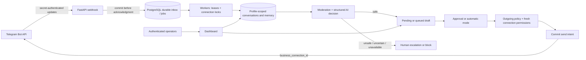

# Architecture and invariants

## Request and job flow

One deployable Python application, independently scaled API and workers, one PostgreSQL database. Server-rendered HTML keeps authentication and authorization in one service. The dashboard needs no frontend build or third-party assets. OpenAI and Telegram are the only runtime outbound API destinations.

## Data model

| Entity | Ownership / key invariant |
|---|---|
| User / session | Admin or explicitly assigned operator; hashed opaque session; expiration enforced server-side |
| Profile | UUID; globally unique immutable Telegram owner ID; separate configuration, version and automation mode |
| Membership | Unique user/profile pair; admin is the explicitly privileged workspace role |
| Connection | Official string connection ID; immutable owner; profile matched only by that exact numeric owner |
| Conversation | Unique `(connection_id, chat_id)`; composite foreign key enforces connection/profile match |
| Message | Unique `(conversation_id, telegram_message_id)`; composite profile/conversation foreign key |
| Memory | Human-curated profile/conversation record; never shared between clients or profiles |
| Draft | Profile/conversation key, conversation revision and profile version; immutable delivery history state |
| Job | Globally unique dedupe key, connection scope, lease, attempts, run time, redacted error |
| Audit | Actor, action, object ID, profile scope and timestamp; no message body or credential |

Incoming edits overwrite stored message text and invalidate drafts. Deletions blank text and retain a tombstone, including if deletion arrives before the original message. Both clear curated memories conservatively because their provenance may depend on changed/deleted content. Original Telegram message dates determine the reply window; edits cannot extend it. Connection-update ordering tolerates Telegram's update-ID randomization after a week without updates; message edits also compare event timestamps.

A reconnect may create a new connection ID. It binds to the same exact owner/profile but gets separate conversations. Old connection history is not automatically merged into a new connection, preventing accidental joins based on reused client IDs. Unknown connections are fetched through the official `getBusinessConnection`; unmatched owners remain unclaimed, and inbound jobs retry then dead-letter. Binding is never inferred from message text.

## Send state machine

`pending → queued → sending → sent`

Alternative terminal states: `rejected`, `stale`, `blocked`, `uncertain`.

1. Lock the Business Connection with a PostgreSQL session advisory lock on a dedicated physical connection. API mutations use the same lock key and return a retryable conflict if it is busy.
2. Fetch the draft within its profile/conversation scope. Validate revision, configuration version, current approver access, enabled/reviewed profile, conversation state and last incoming time.
3. Defer while relevant inbound updates are pending. Limit per-chat sends and automated replies (12 per hour); Telegram 429 responses use its `retry_after`.
4. Re-evaluate the exact outgoing text with safety policy, including manually edited or composed text. Refresh official Business Connection state after this slower work.
5. Recheck inbound work and eligibility, then persist `sending` **before** the network call. Keep the advisory lock through this transaction boundary.
6. Send via official HTTPS `sendMessage` with the exact connection and chat IDs. Persist the returned Telegram message ID.
7. An explicit 429 rejection is safe to retry. A timeout, 5xx, malformed success, DB failure after the call, or worker death around a send must not result in a blind resend. On recovery, a lingering `sending` draft becomes `uncertain` and escalates.

Telegram's send endpoint offers no caller-supplied idempotency key. Exactly-once network delivery cannot be guaranteed. This implementation favors preventing duplicates at the cost of potentially withholding a message. A connection permission or client message can change after the final check; Telegram remains the authority at the actual send. Queued updates are checked both before and after AI work to minimize stale-context sends.

## Job processing

Workers claim jobs using row locks and `SKIP LOCKED`, commit a 600-second lease, then acquire a connection lock. Update jobs take priority. Workers cannot overlap work on the same connection, while different profiles can progress concurrently. Crashed workers' leases expire; non-send jobs retry safely. Contention, pending input and explicit rate limits do not exhaust attempts. Other failures use bounded backoff and six attempts, then appear in Operations. Do not reduce the lease below worst-case provider latency.

Completed inbound jobs retain their deduplication key but clear the raw payload. Durable update acceptance is at-least-once; side effects are deduplicated. No message content enters logs. PostgreSQL connection poolers must use **session pooling or direct connections**, never transaction pooling, because session advisory locks span a commit.

## AI boundary

Only one profile, one conversation's latest 30 non-deleted messages (up to 4,000 characters each) and 10 curated notes enter a request. Requests set `store=false`, use strict structured output, and never use shared provider threads, previous-response IDs, tools or vector stores. Provider retention beyond `store=false` depends on account controls; do not represent it as zero data retention.

Text-only MVP: media is neither downloaded nor transcribed. Meeting booking/payment collection are deliberately absent. Informational pricing and availability are profile fields; they do not create reservations or financial commitments.
